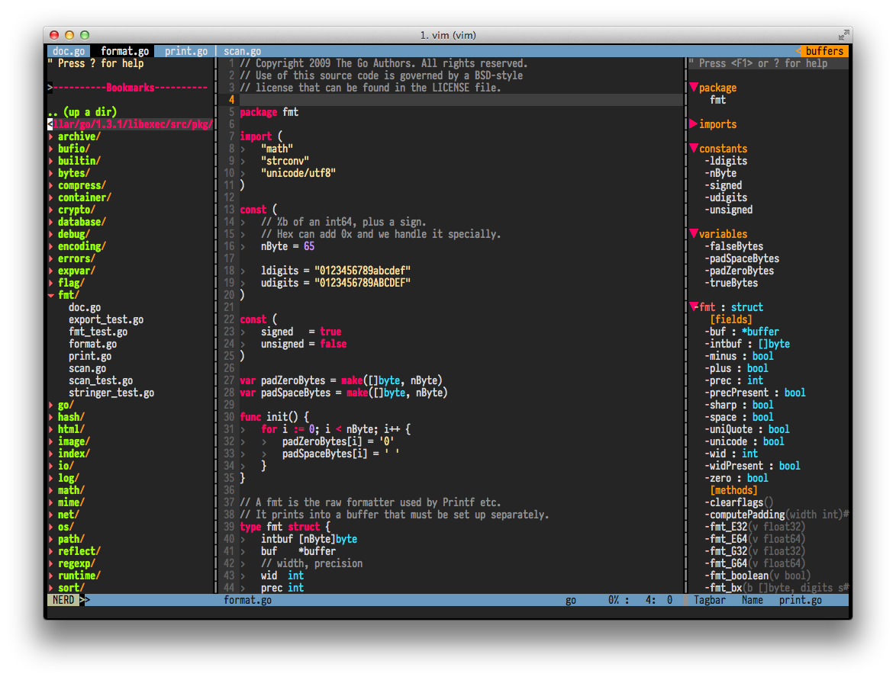

Vim for Mac
============

This is my *personal* vim bundle mainly for Mac, but it should also work on Linux/Unix with a little tweaks.

Prerequisites
=============

* Updated Vim Version
* Build Tools Supports

    brew install cmake ctags
    brew install macvim --with-cscope --with-lua
    brew install vim --with-lua --override-system-vim
    brew linkapps

[Issues with MacVim](https://github.com/b4winckler/macvim/wiki/Troubleshooting)

Install
=======

Run the following line from your terminal

    curl https://raw.githubusercontent.com/jimzhan/dotvim/master/setup -L -o - | sh

Preview
=======

Plugins
=======

### Plugins Manager

[Shougo/neobundle](https://github.com/Shougo/neobundle.vim): based on [gmarik/vundle](https://github.com/gmarik/vundle) but way better with tons of added features.

### File Manager

[scrooloose/nerdtree](https://github.com/scrooloose/nerdtree): IDE-liked file manager.

    map <C-o>   <plug>NERDTreeTabsToggle<CR>

[kien/ctrlp](https://github.com/kien/ctrlp.vim): fuzzy file finder.

### GIT

[tpope/vim-fugitive](https://github.com/tpope/vim-fugitive): the best GIT plugin for Vim with shortcuts.

    nnoremap <silent> <leader>gs :Gstatus<CR>
    nnoremap <silent> <leader>gd :Gdiff<CR>
    nnoremap <silent> <leader>gc :Gcommit<CR>
    nnoremap <silent> <leader>gb :Gblame<CR>
    nnoremap <silent> <leader>gl :Glog<CR>
    nnoremap <silent> <leader>gp :Git push<CR>
    nnoremap <silent> <leader>gw :Gwrite<CR>
    nnoremap <silent> <leader>gr :Gremove<CR>

### Autocomplete

[Shougo/neocomplete](https://github.com/Shougo/neocomplete.vim) + [Shougo/neosnippet](https://github.com/Shougo/neosnippet.vim): lightweight (especially comparing to [YCM](https://github.com/Valloric/YouCompleteMe), compiled size: 175MB on my laptop...) yet powerful. (Required Vim with lua compiled)

### File Editing

[scrooloose/nerdcommenter](https://github.com/scrooloose/nerdcommenter): help comment/uncomment blocks in document.

### Status Bar

[bling/vim-airline](https://github.com/bling/vim-airline): Status line enhancements with buffers listing enabled.

### Default Theme

[tomasr/molokai](https://github.com/tomasr/molokai): by far, this is simply the best color scheme I've ever tested that works beautifully on both iTerms & Gvim right out of the box.

Mapping
=======
* *jj*            \<ESC\>
* Uses , as \<Leader\>
